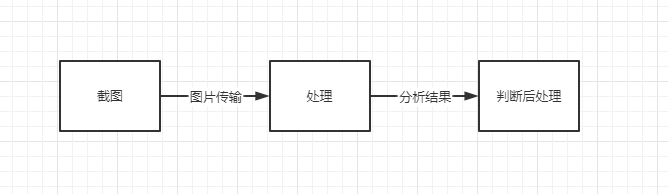

# Android 辅助服务实战-游戏点击器

## 背景：

前几年我一直在玩一款氪金养成类手游<<末日危机>>，每天都有任务需要完成，那时游戏里面还没有一键收菜，我去年（接手了公会里面不少弃坑号，越玩越是耗时间）就想做了一些辅助软件减轻我的负担，先是在PC做了个自动点击完成关卡战斗，后面觉得天天开虚拟机太麻烦，不如直接在手机上完成。

思路：

Android系统有提供一个无障碍功能：AccessbilityService，在Android6.0之前能访问第三方应用的当前布局和控件结点，现在Android手机系统等级动辄10以上，已经不能用这种直接获取控件的方式，要使用截图再进行图片识别目标位置，再进行坐标位置上的点击。



首先手机上需要开启辅助服务，该服务在手机截图API实现要求手机版本至少要Android10。具体代码如下

```
    private fun isAccessibilitySettingsOn(mContext: Context): Boolean {
        var accessibilityEnabled = 0
        // TestService为对应的服务
        val service = packageName + "/" + AccessbilityServiceImp::class.java.canonicalName
        Log.i(TAG, "service:$service")
        try {
            accessibilityEnabled = Settings.Secure.getInt(
                mContext.applicationContext.contentResolver,
                Settings.Secure.ACCESSIBILITY_ENABLED
            )
            Log.v(TAG, "accessibilityEnabled = $accessibilityEnabled")
        } catch (e: SettingNotFoundException) {
            Log.e(TAG, "Error finding setting, default accessibility to not found: " + e.message)
        }
        val mStringColonSplitter = SimpleStringSplitter(':')
        if (accessibilityEnabled == 1) {
            Log.v(TAG, "***ACCESSIBILITY IS ENABLED*** -----------------")
            val settingValue = Settings.Secure.getString(
                mContext.applicationContext.contentResolver,
                Settings.Secure.ENABLED_ACCESSIBILITY_SERVICES
            )
            if (settingValue != null) {
                mStringColonSplitter.setString(settingValue)
                while (mStringColonSplitter.hasNext()) {
                    val accessibilityService = mStringColonSplitter.next()
                    Log.v(
                        TAG,
                        "-------------- > accessibilityService :: $accessibilityService $service"
                    )
                    if (accessibilityService.equals(service, ignoreCase = true)) {
                        Log.v(
                            TAG,
                            "We've found the correct setting - accessibility is switched on!"
                        )
                        return true
                    }
                }
            }
        } else {
            Log.v(TAG, "***ACCESSIBILITY IS DISABLED***")
        }
        return false
    }
```

### 具体实现：

开启了辅助服务后，我们需要一个媒介和该服务进行交互，并且不能影响后续的截图效果，一种能在屏幕上进行收缩的工具栏。

我采用**系统消息通知栏+广播**来解决这个问题，它会和辅助服务进行交互：


```
object GameNotification {
    private var manager: NotificationManager? = null
    private var remoteViews: RemoteViews? = null
    var notify: Notification? = null

    fun createNotificaton(context: Context) {
        manager = context.getSystemService(AccessibilityService.NOTIFICATION_SERVICE) as NotificationManager

        // 设置通知栏的图片文字
        remoteViews = RemoteViews(
            context.packageName,
            R.layout.custom_notice
        )

        remoteViews!!.setImageViewResource(R.id.widget_play, R.drawable.ic_baseline_play_arrow_24)
        remoteViews!!.setImageViewResource(R.id.widget_stop, R.drawable.ic_baseline_stop_24)

        val builder = NotificationCompat.Builder(context)

        val intent = Intent(context, MainActivity::class.java)
        // 点击跳转到主界面
        val intent_go = PendingIntent.getActivity(
            context, 0, intent,
            PendingIntent.FLAG_UPDATE_CURRENT
        )
        remoteViews!!.setOnClickPendingIntent(R.id.notice, intent_go)

 		// 设置开始按键
        val start = Intent()
        start.action = Command.ACTION_START
        val intent_start = PendingIntent.getBroadcast(
            context, 0, start,
            PendingIntent.FLAG_UPDATE_CURRENT
        )
        remoteViews!!.setOnClickPendingIntent(R.id.widget_play, intent_start)

        // 设置停止按键
        val stop = Intent()
        stop.action = Command.ACTION_STOP
        val intent_stop = PendingIntent.getBroadcast(
            context, 1, stop,
            PendingIntent.FLAG_UPDATE_CURRENT
        )
        remoteViews!!.setOnClickPendingIntent(R.id.widget_stop, intent_stop)
        builder.setSmallIcon(R.drawable.ic_launcher_background) // 设置顶部图标
        if (Build.VERSION.SDK_INT >= Build.VERSION_CODES.O) {
            val mChannel = NotificationChannel("123", "147", NotificationManager.IMPORTANCE_LOW)
            manager!!.createNotificationChannel(mChannel)
            notify = Notification.Builder(context)
                .setChannelId("123")
                //                    .setContentTitle("5 new messages")
                //                    .setContentText("hahaha")
                .setContent(remoteViews)
                .setSmallIcon(R.mipmap.ic_launcher).build()
        } else {
            notify = builder.build()
            notify!!.contentView = remoteViews // 设置下拉图标
            notify!!.bigContentView = remoteViews // 防止显示不完全,需要添加apisupport
            notify!!.flags = Notification.FLAG_ONGOING_EVENT
        }
        manager!!.notify(100, notify)
    }

}
```

通过广播进行消息传输，告诉辅助服务可以执行或者停止当前选择的任务。


### 识别图片：

屏幕截图获取代码片段：

执行截图：

```
@RequiresApi(Build.VERSION_CODES.R)
fun startSnapShoot() {
    accessbilityServiceImp!!.mHandler.postDelayed({
        accessbilityServiceImp!!.takeScreenshot(
            Display.DEFAULT_DISPLAY,
            accessbilityServiceImp!!.mainExecutor,mCallBack)
    },1000)
}
```

接收截图数据：

```
 @RequiresApi(Build.VERSION_CODES.R)
    var mCallBack:AccessibilityService.TakeScreenshotCallback = object :AccessibilityService.TakeScreenshotCallback{

        override fun onSuccess(screenshotResult: AccessibilityService.ScreenshotResult) {

            val nodeInfo = accessbilityServiceImp?.rootInActiveWindow
            val result = nodeInfo?.let { accessbilityServiceImp?.findNodeInfosByText(it,"任务") }
            Log.e("AccessbilityServiceImp","onSuccess = "+screenshotResult+",result = "+result)

            var timespec = 500L
            accessbilityServiceImp!!.timespec = 1000L
            val hardwareBuffer = screenshotResult.hardwareBuffer
            val colorSpace = screenshotResult.colorSpace
            if (hardwareBuffer.width > 0 && hardwareBuffer.height > 0 && colorSpace != null) {
                val bitmap = Bitmap.wrapHardwareBuffer(hardwareBuffer, colorSpace)
            ...
            }
        }
     }
     ...
```

把获取的数据转换成bitmap,后面使用opencv进行图片识别。

#### 竞技场挑战任务：

竞技场页面获取当前在场队伍的战力值：

```
 fun detectNumberRect(bitmap: Bitmap, list: List<Mat>): List<ComplyPlayInfo> {
        val bitmapNew: Bitmap = bitmap.copy(Bitmap.Config.ARGB_8888, true)
        var resultPlays :List<ComplyPlayInfo>
        val dectectedPlays = ArrayList<ComplyPlayInfo>()
        var myPlayInfo = ComplyPlayInfo(0,0)

        //opencv初始化
        if (!OpenCVLoader.initDebug()) {
            Log.d("--------opencv--------", "OpenCVLoader error")
        }
        //Mat変換
        val src = Mat(bitmapNew.height, bitmapNew.width, CvType.CV_8UC4)
        Utils.bitmapToMat(bitmapNew, src)
        
        //获取战力值所在的坐标位置集合
        val rects = detectPowerNumberRect(bitmap)

        rects.mapIndexed {index,it->
            val mRgb = Mat(src, it)

            val b = Bitmap.createBitmap(
                mRgb!!.cols(), mRgb.rows(),
                Bitmap.Config.ARGB_8888
            )
            Utils.matToBitmap(mRgb, b)

            val dst = Mat.zeros(Size(src.width().toDouble(), src.height().toDouble()), CvType.CV_8UC3)
            //绘制轮廓 (Yellow)
            var color = Scalar(255.0, 255.0, 0.0)

            //灰色化
            Imgproc.cvtColor(mRgb, mRgb, Imgproc.COLOR_RGB2GRAY)

            bitwise_not(mRgb, mRgb);
            //二値化
            Imgproc.threshold(
                mRgb, mRgb, 0.0, 250.0,
                Imgproc.THRESH_BINARY or Imgproc.THRESH_OTSU
            )
            Utils.matToBitmap(mRgb, b)
            //比特反转
            val hierarchy = Mat.zeros(Size(0.0, 0.0), CvType.CV_8UC1)

            // 輪郭抽出
            val contours: List<MatOfPoint> = ArrayList()

            Imgproc.findContours(
                mRgb,
                contours,
                hierarchy,
                Imgproc.RETR_TREE,
                Imgproc.CHAIN_APPROX_SIMPLE
            )
            Imgproc.drawContours(dst, contours, -1, color, 1)
            var box: Rect?
            var boxs = ArrayList<Rect>()
            for (i in contours.indices) {

                val ptmat: MatOfPoint = contours[i]
                // 轮廓的重心的绘制 (Red)
                color = Scalar(255.0, 0.0, 0.0)
                val ptmat2 = MatOfPoint2f(*ptmat.toArray())
                val bbox = Imgproc.minAreaRect(ptmat2)
                box = bbox.boundingRect()

                if (box.width < box.height && box.height < 50 && box.height > 25
                    && box.y < 10) {
                    Imgproc.circle(dst, bbox.center, 5, color, -1)
                    // 周围轮廓四角形绘制 (Green)
                    color = Scalar(0.0, 255.0, 0.0)
                    Imgproc.rectangle(dst, box.tl(), box.br(), color, 2)

                    boxs.add(box)
                }
            }
            boxs.sortBy {
                it.x
            }

            val result = ArrayList<NumberInfo>()
            var num = 0L

            boxs.mapIndexed { index, it ->
                if (it.x+it.width>mRgb.width()){
                    it.width = mRgb.width()-it.x
                }
                val tmp = Mat(mRgb, it)
                val tmpBitmap = Bitmap.createBitmap(
                    tmp!!.cols(), tmp.rows(),
                    Bitmap.Config.ARGB_8888
                )
                Utils.matToBitmap(tmp, tmpBitmap)
                list.mapIndexed { index, it ->
                    val result_cols: Int = abs(tmp.cols() - it.cols()) + 1
                    val result_rows: Int = abs(tmp.rows() - it.rows()) + 1
                    val res = Mat(result_rows, result_cols, CvType.CV_32FC1)
                    //归一化
                    var item = it
                    val bitmap2 = Bitmap.createBitmap(
                        it!!.cols(), it!!.rows(),
                        Bitmap.Config.ARGB_8888
                    )
                    Utils.matToBitmap(it, bitmap2)
                    Imgproc.resize(it, it, Size(tmp.width().toDouble(), tmp.height().toDouble()))
                    Imgproc.matchTemplate(tmp, item, res, Imgproc.TM_SQDIFF)
                    val bitmap = Bitmap.createBitmap(
                        tmp!!.cols(), tmp!!.rows(),
                        Bitmap.Config.ARGB_8888
                    )
                    Utils.matToBitmap(tmp, bitmap)
                    val bitmap1 = Bitmap.createBitmap(
                        item!!.cols(), item!!.rows(),
                        Bitmap.Config.ARGB_8888
                    )
                    Utils.matToBitmap(item, bitmap1)
                    //获得最可能点，MinMaxLocResult是其数据格式，包括了最大、最小点的位置x、y
                    val mlr = Core.minMaxLoc(res)
                    result.add(NumberInfo(mlr.minVal, index))

                    Log.e(
                        "AccessbilityServiceImp", "mlr result minVal="
                                + mlr.minVal + ",maxVal=" + mlr.maxVal + ",minLoc=" + mlr.minLoc + ",maxLoc=" + mlr.maxLoc
                    )

                }
                result.sortBy {
                    it.minValue
                }
                num += result[0].index * 10.0.pow(boxs.size.toDouble() - 1 - index).toLong()
                result.clear()
            }
            if (index == 0){
                myPlayInfo = ComplyPlayInfo(num,index)
            }else{
                dectectedPlays.add(ComplyPlayInfo(num,index))
            }
            Log.e("AccessbilityServiceImp", "num result =" + num)
        }
        resultPlays = dectectedPlays.filter { myPlayInfo.strength > it.strength }

        Log.e("AccessbilityServiceImp", "resultPlays =" + resultPlays)
        return resultPlays
    }
```

调用 Imgproc.matchTemplate()，使用数字模板对比，相似度高的就认为是该阿拉伯数字，逐个数字叠加后获得战力值，返回战力值比自己队伍低的集合，上层获取到该值后挑选还能挑战的队伍进行战斗，（相同的队伍当天只能挑战它8次）。


#### 任务栏刷任务：

在任务栏进行刷任务操作需要进行的步骤：识别当前视图所有的任务的星数（1到7星）->挑选符合条件的任务刷新->向右滑动任务->重新识别还没有操作过的任务->刷新完后点击一键领取已经完成的任务。


识别当前任务的星数代码片段：

```
    private fun cutStarsPictrue(bitmap: Bitmap, list: ArrayList<Rect>): List<TaskInfo> {
        val bitmapNew: Bitmap = bitmap.copy(Bitmap.Config.ARGB_8888, true)

        //opencv初始化
        if (!OpenCVLoader.initDebug()) {
            Log.d("--------opencv--------", "OpenCVLoader error")
        }
        //Mat变换
        val mRgb = Mat(bitmapNew.height, bitmapNew.width, CvType.CV_8UC4)
        Utils.bitmapToMat(bitmapNew, mRgb)
        var starsNum = ArrayList<TaskInfo>()
        list.map {
            val rect = Rect(it.x + 15, it.y + 8, it.width - 35, it.height - 18)

            val src = Mat(mRgb, rect)

            val b = Bitmap.createBitmap(
                src!!.cols(), src.rows(),
                Bitmap.Config.ARGB_8888
            )

            Utils.matToBitmap(src, b)

            val num = returnStarsNum(b)
            starsNum.add(TaskInfo(rect,num))

            Log.e("AccessbilityServiceImp", " num =" + num)
        }
        return starsNum
    }
```


识别当前任务的内容代码片段：（主要是识别当前任务是否符合条件，三星任务只需要英雄碎片，4星任务抛弃竞技场挑战券，4星以上任务全部完成）

```
fun cutTaskContent(bitmap: Bitmap, list: List<TaskInfo>): List<TaskInfo> {
    val bitmapNew: Bitmap = bitmap.copy(Bitmap.Config.ARGB_8888, true)

    //opencv初始化
    if (!OpenCVLoader.initDebug()) {
        Log.d("--------opencv--------", "OpenCVLoader error")
    }
    //Mat変換
    val mRgb = Mat(bitmapNew.height, bitmapNew.width, CvType.CV_8UC4)
    Utils.bitmapToMat(bitmapNew, mRgb)
    var starsNum = ArrayList<TaskInfo>()
    var rect:Rect
    list.map {
        //如果是3星任务截图区域
        if (it.stars < 4){
             rect = Rect(it.rect.x + bitmapNew.width/23, it.rect.y - 3 + bitmapNew.height/32*9, it.rect.width/3 , it.rect.height/2 )
        }else {
            //如果是4-5星任务截图区域
             rect = Rect(
                it.rect.x + bitmapNew.width / 60,
                it.rect.y + bitmapNew.height / 33 * 6,
                it.rect.width / 5,
                 it.rect.width / 3
            )
        }
            val src = Mat(mRgb, rect)

            val b = Bitmap.createBitmap(
                src!!.cols(), src.rows(),
                Bitmap.Config.ARGB_8888
            )

            Utils.matToBitmap(src, b)

            val num = returnTaskStarsNum(b)
        /*
        如果是3星任务返回5是英雄碎片
        如果是4，5星任务返回5是竞技场挑战券
         */
        if (it.stars < 4) {
            if (num >= 4) {
                starsNum.add(it)
            }
        }else{
            if (num in 5..9) {
                starsNum.add(it)
            }
        }

        Log.e("AccessbilityServiceImp", " starsNum =" + starsNum)
    }
    return starsNum
}
```

### 指令执行：

复杂的点击和滑动指令操作需要一个执行者来完成：Handler

```
val mHandler:TaskHandler = TaskHandler()

    class TaskHandler:Handler(Looper.getMainLooper()){
        override fun handleMessage(msg: Message) {
            val callback = msg.obj as ()->Unit
            callback.invoke()
        }
    }
```

用消息把不同的指令传给Handler去处理，可以延时执行，也可以随时取消没有完成的指令任务。

```
    //滑动
    fun slidingScreen(scrollData: ScrollData, delayTime: Long){
        val callback = {
            if (height != 0f) {
                if (width != 0f) {
                    ActionDeal(width/2,height/2,scrollData,62)
                }
            }
        }
        timespec = delayTime
        mHandler.postDelayed(callback,-1,delayTime)
    }
    //点击
    fun clickScreen(x:Float,y: Float){
        val callback = {
            ActionDeal(x,y,null,62)
        }
        mHandler.postDelayed(callback,-1,timespec)
        timespec+=1000
        Log.e("AccessbilityServiceImp","timespec = "+timespec)

    }
	//点击（带时间差）
    fun clickScreen(x:Float,y: Float,delayTime: Long){
        val callback = {
            if (height != 0f) {
                if (width != 0f) {
                    ActionDeal(x,y,null,62)
                }
            }
        }
        mHandler.postDelayed(callback,62,delayTime)
    }
```

不用指令之间的等待时间各不相同，需要给根据实际的时间差来完成一连串指令。

创建任务实体类：

```
data class TaskInfo(val callback: () -> Unit, val timespec: Long, val id:Int)
```

创建任务集合：

```
var taskList = ArrayList<TaskInfo>()
```

Handler执行所有的指令任务：

```
taskList.add(TaskInfo({localBroadcastReceiver.startSnapShoot()},timespec,48))

taskList.map {
    Log.e("AccessbilityServiceImp","timespec = "+it.timespec)
    mHandler.postDelayed(it.callback,it.timespec)
}
```